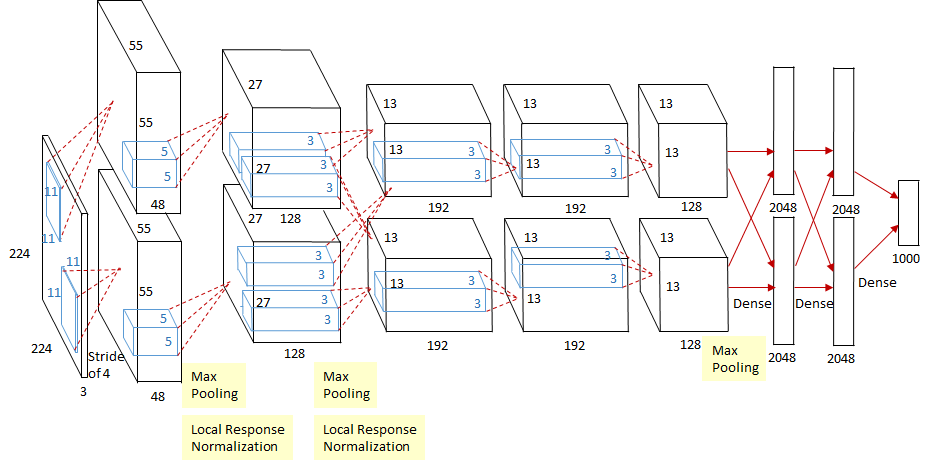

 <h2 align="center">AlexNet</h2>
 
 This is a tensorflow implementation of (Krizhevsky et al., 2012) paper.
 
<br>

<p align="center">
  
</p>

### Instructions

- Set Up Virtual Environment (Optional but Recommended)

```bash
python -m venv venv
source venv/bin/activate 
```

- Clone the repository
```bash
git clone https://github.com/thlurte/AlexNet-tensorflow.git

```

- Change into the directory of the repository

```bash

cd AlexNet-tensorflow
```

- Install Dependancies

```bash
pip install -r requirments.txt
```

- To Train the model

```bash
python main.py --data_dir <path-to-dataset>

```

### Architecture

AlexNet comprises of eight layers – five convolutional and three fully connected. The output of the last fully-connected layer is fed to 1000-way `softmax` which produces a distribution over the 1000 class labels.

The first convolutonal layer filters the `256x256x3` input image with 96 ernels of size `11x11x3` with a stride of 4 pixels. The second convolutional layer takes as input the out of the first convolutional layer and filters it with 256 kernels of size `5x5x48`. The third convolutional layer has 384 kernels of size `3x3x256` connected to the outputs of the second convolutional layer. The forth convolutional layer has 383 kernels of size `3x3x192`, and the fifth convolutional layer has 256 kernels of size `3x3x192`. The fully-connected layers have 4096 neurons each.

### ReLU Nonlinearity

ReLU activation is applied after each convolutional and fully connected layers except final layer.

### Local Response Normalization

LRN is applied after applying the ReLU nonlinearity in first and second convolutional layers.

### Max-pooling

Max-pooling layers follow both response normalization layers and fifth convolutional layer.

### Dopout

Dropout is used in the first two fully-connected layers. This helps us avoid overfitting substantially.


### Learning Rate

The model uses stochastic gradient descent with a batch size of 128 samples, momentum of 0.9, and weight decay of 0.0005.

### Weights

Weights are initialized in each layer from a zero-mean Gaussian distribution with standard deviation 0.01.

Bias intializer in second, forth and fifth convolutional layers as well as in the fully-connected layer is 1. Remaining layers are intialized with the constant of 0.
